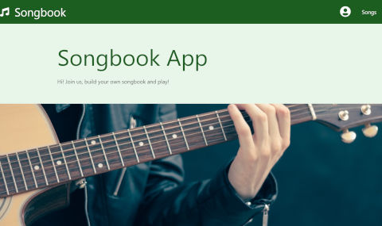
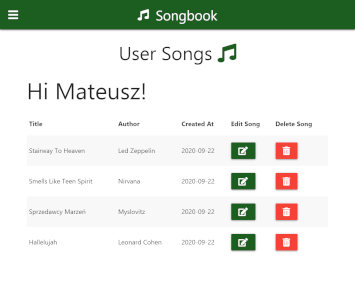

<!-- PROJECT LOGO -->
<br />
<p align="center">
  <a href="https://github.com/mateuszlubianka1993/songs-lyrics-app">
    
  </a>

  <h3 align="center">Songbook App</h3>

  <p align="center">
    Simple Songbook Node App.
    <br />
    <br />
    <a href="http://songbook-node-app.herokuapp.com/">View Demo</a>
  </p>
</p>


<!-- TABLE OF CONTENTS -->
## Table of Contents

* [About the Project](#about-the-project)
  * [Built With](#built-with)
* [Usage](#usage)
* [Screens](#screens)
* [Getting Started](#getting-started)
  * [Prerequisites](#prerequisites)
  * [Installation](#installation)
* [Contact](#contact)


<!-- ABOUT THE PROJECT -->
## About The Project

This is the Songbook App. This is my first express js app. 
You can login by your google account and add new songs with chords. You can also see songs added by another users, deleting and editing your songs.
**Scroll down to get more info**

### Built With

* Node js
* Express js
* EJS
* Passport
* Mongo DB
* Mongoose

## Usage


## Screens




<!-- GETTING STARTED -->
## Getting Started

To get a local copy up and running follow these simple steps.

### Prerequisites

This is an example of how to list things you need to use the software and how to install them.
* npm
```sh
npm install npm@latest -g
```

### Installation
 
1. Clone the repo
```sh
git clone https://github.com/mateuszlubianka1993/songs-lyrics-app
```
2. Install NPM packages
```sh
npm install
```
3. Compiles and hot-reloads for development
```sh
npm run dev
```
4. Run production version
```sh
npm start
```


<!-- CONTACT -->
## Contact

* Project Link: [https://github.com/mateuszlubianka1993/songs-lyrics-app](https://github.com/mateuszlubianka1993/songs-lyrics-app)
* Live Demo: [http://songbook-node-app.herokuapp.com/](http://songbook-node-app.herokuapp.com/)
